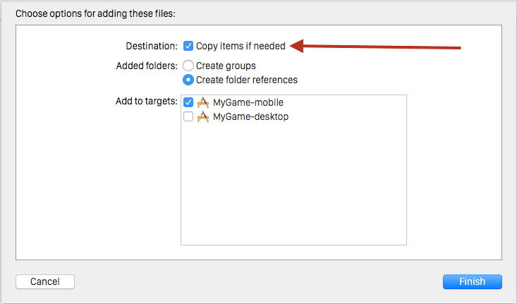
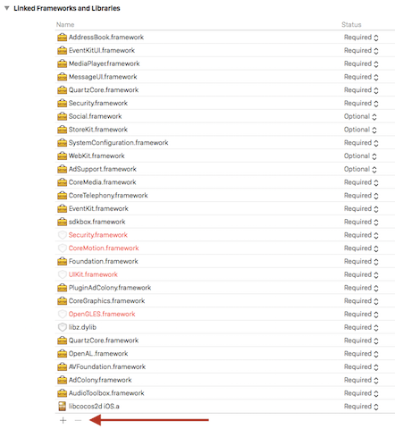

#SDKBOX: AdColony Installation with Cocos2d-x v3.x and C++#

##概要##
このドキュメントでは[Cocos2d-x SDKBOX](http://cocos2d-x.org/sdkbox#)のAdColonyの導入方法について説明します。正式版のドキュメント（英語）は[こちら](http://sdkbox-doc.github.io/en/plugins/adcolony/v3-cpp/)からご参照ください。

**参照**：[http://cocos2d-x.org/sdkbox/adcolony](http://cocos2d-x.org/sdkbox/adcolony)

##Contents##
* [Step 0: Prerequisites](#step-0-prerequisites)
* [Step 1: Integration](#step-1-integration)
* [Step 2: Configuration](#step-2-configuration)
* [Step 3: Usage](#step-3-usage)
* [Manual Integration](#manual-integration)
* [よくある質問](#qa-section)
    * [基本情報に関して](#qa-basic)
    * [SDK仕様に関して](#qa-sdk)
    * [動画再生に関して](#qa-play-video)
    * [ストア申請に関して](#qa-store-submit)


##Step 0: Prerequisites##
* Glossomにてapp ID、zone IDを発行しお渡し致します。

##Step 1: Integration

ターミナルを開いて以下のコマンドを実行し、SDKBOXのAdColonyプラグインをインストールしてください。[SDKBOXのインストーラー](http://www.cocos2d-x.org/sdkbox/adcolony)が正しくセットアップされていることを確認してください。

	$ cd ~/MyGame
	$ sdkbox import adcolony

###iOS 9サポート###
Xcode 7をご利用の場合、下記の手順を実装する必要があります。

####App Transport Securityを無効に####
下記をplistに設定してください。

        <key>NSAppTransportSecurity</key>
        <dict>
            <key>NSAllowsArbitraryLoads</key>
            <true/>
        </dict>


####Bitcodeを無効に####
Bitcodeサポートを無効にしてください。有効の場合cocos2d-xのビルドがエラーになります。

####Requires full screenを有効に####
アプリは全方向対応でない場合は、Targets -> General -> Deployment Info -> Requires full screen にチェックしてください。チェックをしない場合、ストア申請時にエラーになります。

####canOpenURLを許可するURLリストの設定####
こちらは、利用しているプラグインによりますが、AdColonyを利用してる場合、[こちら](https://github.com/glossom-dev/AdColony-iOS-SDK-JP-Support/blob/master/iOS-9.md#canopenurlについて)を参照してください。
##Step 2: Configuration

SDKBOXが自動的に`./Resource/sdkbox_config.json`を作成してくれるので、アプリで使用をする前にその設定を修正しなければいけません。

以下がAdColonyの設定のサンプルです。`<app id>`と`<zone id>`をGlossomにて発行がされたものに置き換えてください。

```json
{
    "android": {
        "AdColony": {
            "debug": true, 
            "id": "<app id>", 
            "ads": {
                "v4vc": {
                    "v4vc": true, 
                    "pre_popup": true, 
                    "zone": "<zone id>", 
                    "post_popup": true
                }, 
                "video": {
                    "v4vc": false, 
                    "zone": "<zone id>"
                }
            }
        }
    }, 
    "ios": {
        "AdColony": {
            "debug": true, 
            "id": "<app id>", 
            "ads": {
                "v4vc": {
                    "v4vc": true, 
                    "pre_popup": true, 
                    "zone": "<zone id>", 
                    "post_popup": true
                }, 
                "video": {
                    "v4vc": false, 
                    "zone": "<zone id>"
                }
            }
        }
    }
}
```

##Step 3: Usage

###3.1 Initialize AdColony

適当な場所でプラグインを初期化してください。`AppDelegate::applicationDidFinishLaunching()`もしくは`AppController:didFinishLaunchingWithOptions()`を推奨しています。適切なヘッダーファイルをインクルードするのを忘れないようにしてください。

```cpp
#include "PluginAdColony/PluginAdColony.h"
AppDelegate::applicationDidFinishLaunching()
{
     sdkbox::PluginAdColony::init();
}
```

###3.2 Showing Ads

広告の種類を指定し、任意の場所で広告を表示してください。

```cpp
sdkbox::PluginAdColony::show("video");
```

もしくは

```cpp
sdkbox::PluginAdColony::show("v4vc");
```

###3.3 Catch AdColony events (optional)

プラグインはAdColonyのイベントをキャッチすることができるので、動画を見たユーザに対して報酬を付与するといったような処理を実行することができます。

* 下記のように、sdkbox::AdColonyListenerを継承して実装してください。

```cpp
#include "PluginAdColony/PluginAdColony.h"
class MyClass : public sdkbox::AdColonyListener
{
private:
  void onAdColonyChange(const sdkbox::AdColonyAdInfo& info, bool available);
  void onAdColonyReward(const sdkbox::AdColonyAdInfo& info,
        const std::string& currencyName, int amount, bool success);
  void onAdColonyStarted(const sdkbox::AdColonyAdInfo& info);
  void onAdColonyFinished(const sdkbox::AdColonyAdInfo& info);
};
```

* コールバックを処理するリスナーを作成してください。

```cpp
sdkbox::PluginAdColony::setListener(this);
```

##Manual Integration

もしSDKBOXのインストーラーが正常に処理を完了しない場合、SDKBOXをマニュアルで統合することが可能です。インストーラーが正常に処理を完了した場合は、これ以降のドキュメントの内容は必要ありません。

この手順は殆ど必要とされないのでドキュメントの最後に記載をしています。以下の手順を行った場合、完了されたあとに、その他の統合項目について、再度上記のドキュメントの確認をお願いいたします。

###Manual Integration For iOS

*  **plugins/ios**フォルダーから下記のフレームワークをXcodeプロジェクトにドラッグ&ドロップしてください。追加するときに、`Copy items if needed`をチェックしてください。
	* sdkbox.framework
	* PluginAdColony.framework
	* AdColony.framework

		

* 上記のフレームワークは下記にのシステムフレームワークに依存していますので、プロジェクトに追加されなかったら追加をしてください。
    * libz.1.2.5.dylib
    * AdSupport.framework (Set to Optional)
    * AudioToolbox.framework
    * AVFoundation.framework
    * CoreGraphics.framework
    * installation_guide-html.html
    * CoreMedia.framework
    * CoreTelephony.framework
    * EventKit.framework
    * EventKitUI.framework
    * MediaPlayer.framework
    * MessageUI.framework
    * QuartzCore.framework
    * Security.framework
    * Social.framework (Set to Optional)
    * StoreKit.framework (Set to Optional)
    * SystemConfiguration.framework
    * WebKit.framework (Set to Optional)

		

* **Target > Build Settings > Linking > Other Linker Flags**を開いて、下記の二つのフラグを設定してください。

        -force_load AdColony.framework/AdColony
        -fobjc-arc (AdColonyではARCを設定していないプロジェクトでも利用することができます。)

###Manual Integration For Android.

SDKBOXは**command-line**、**eclipse**と**Android Studio**の3つAndroidプロジェクトをサポートしています。

- `proj.android`はcommand-lineとeclipseプロジェクトの`<project_root>`として使用されます 
- `proj.android-studio`はAndroid Studioプロジェクトの`<project_root>`として使用されます 

**2.1 Copy Files**

* **.sdkbox/plugins/sdkbox-adcolony_vX.Y.Z/plugin/android/libs**フォルダーから下記の**jar**ファイルをあなたのプロジェクトの**/libs**下にコピーしてください。
	* adcolony.jar
	* PluginAdColony.jar
	* sdkbox.jar

>- もしcocos2d-xをソースコードからインストールした場合はjarファイルのコピー先はこちらです
>  - Android command-line: `cocos2d/cocos/platform/android/java/libs`
>  - Android Studio: `cocos2d/cocos/platform/android/libcocos2dx/libs`
>- もしcocos2d-jsかluaを使用している場合はjarファイルのコピー先はこちらです
>  - Android command-line: `frameworks/cocos2d-x/cocos/platform/android/java/libs`
>  - Android Studio: `frameworks/cocos2d-x/cocos/platform/android/libcocos2dx/libs`
>- もしビルド済みのcocos2d-xを使用している場合はjarファイルのコピー先はこちらです
>  - Android command-line: `proj.android/libs`


* **plugin/android/jni**からあなたのプロジェクトの**<project_root>/jni/**に全てのフォルダをコピー・上書きしてください。

**注意:** SDKBOXはデフォルトで**gnustl**とリンクしています。もしあなたのプロジェクトが**c++static**とリンクしていたら、**<project_root>/jni/<plugin_name>/libs**内のファイルを**<project_root>/jni/<plugin_name>/libs_c++_static**内のファイルで置き換えてください

**2.2 Edit AndroidManifest.xml**

* `AndroidManifest.xml`ファイルに下記のパーミッションを追加してください。

```xml
<uses-permission android:name="android.permission.INTERNET" /\>
<uses-permission android:name="android.permission.WRITE_EXTERNAL_STORAGE" /\>
<uses-permission android:name="android.permission.ACCESS_NETWORK_STATE" /\>
<uses-permission android:name="android.permission.VIBRATE" /\>
```

* **application**タグに下記のようにハードウェアアクセラレーションを有効にしてください。

```xml
<android:hardwareAccelerated="true" /\>
```

* 下記のように、Acitivityの設定を**application**タグの間にコピーしてください。

```xml
<activity android:name="com.jirbo.adcolony.AdColonyOverlay"
	android:configChanges="keyboardHidden|orientation"
	android:theme="@android:style/Theme.Translucent.NoTitleBar.Fullscreen" /\>
<activity android:name="com.jirbo.adcolony.AdColonyFullscreen"
	android:configChanges="keyboardHidden|orientation"
	android:theme="@android:style/Theme.Black.NoTitleBar.Fullscreen" /\>
<activity android:name="com.jirbo.adcolony.AdColonyBrowser"
	android:configChanges="keyboardHidden|orientation"
	android:theme="@android:style/Theme.Black.NoTitleBar.Fullscreen" /\>
```

**注意:** アプリがAPI レベル13以下に対応している場合、上記`configChanges`設定から`screenSize`を消してください。

**2.3 Edit Android.mk**

下記の通りに、**proj.android/jni/Android.mk** ファイルを設定してください。

* `LOCAL_STATIC_LIBRARIES`　の設定：

        LOCAL_STATIC_LIBRARIES += PluginAdColony
        LOCAL_STATIC_LIBRARIES += sdkbox

* 下記を一番最初の**import-module**コードの前に追加してください。

        $(call import-add-path,$(LOCAL_PATH))

* 一番後ろに下記の*import-module**コードを追加してください。

        $(call import-module, ./sdkbox)
        $(call import-module, ./pluginadcolony)

**注意：** 既存に`$(call import-module,./prebuilt-mk)`がある場合、上記をその前に追加してください。

**2.4  `Application.mk`の設定（Cocos2d-x v3.0 から v3.2 までのみ必要）**

 **proj.android/jni/Application.mk** を開いて、**APP_STL**を下記のように設定してください。

    APP_STL := gnustl_static

**2.5 `Cocos2dxActivity.java`の設定**

**注意：** Cocos2d-xのインストール方法によって`Cocos2dxActivity.java`は二つの場所にある可能性があります。プリービルドされたライブラリーを利用してる場合**proj.android/src/org/cocos2dx/lib/Cocos2dxActivity.java**にあります。
ソースコードからインストールした場合、**cocos2d/cocos/platform/android/java/src/org/cocos2dx/lib/Cocos2dxActivity.java**にあります。

* まず、**Cocos2dxActivity.java**に必要なパケージをインポート：

```java
import android.content.Intent;
import com.sdkbox.plugin.SDKBox;
```

*  次に、`Cocos2dxActivity`の`onCreate(final  Bundle savedInstanceState)`に下記のようにプライグインの初期化コードを記述してください。
 `SDKBox.init(this);` は必ず `onLoadNativeLibraries();`の後に記述する必要があります。

```cpp
onLoadNativeLibraries();
SDKBox.init(this);
```

* 最後に、下記のようにオバーライド関数を実装してください。

```cpp
@Override
protected void onActivityResult(int requestCode, int resultCode, Intent data) {
    if (!SDKBox.onActivityResult(requestCode, resultCode, data)) {
        super.onActivityResult(requestCode, resultCode, data);
    }
}

@Override
protected void onStart() {
    super.onStart();
    SDKBox.onStart();
}

@Override
protected void onStop() {
    super.onStop();
    SDKBox.onStop();
}

@Override
protected void onResume() {
    super.onResume();
    SDKBox.onResume();
}

@Override
protected void onPause() {
    super.onPause();
    SDKBox.onPause();
}

@Override
public void onBackPressed() {
    if (!SDKBox.onBackPressed()) {
        super.onBackPressed();
    }
}
```

**Step 2.6: Proguardの設定 (リリース版, 任意)**

* 下記のように、`project.properties` にProguardの設定ファイルを指定してください。

        proguard.config=${sdk.dir}/tools/proguard/proguard-android.txt:proguard-project.txt

* 上記で指定したファイルに下記を追加してください。

        # adcolony
        -dontwarn android.webkit.**

        -dontwarn com.jirbo.adcolony.**
        -keep public class com.jirbo.adcolony.** { public *; }


        # cocos2d-x
        -keep public class org.cocos2dx.** { *; }
        -dontwarn org.cocos2dx.**
        -keep public class com.chukong.** { *; }
        -dontwarn com.chukong.**

        # google play service
        -keep public class com.google.android.gms.** { public *; }
        -dontwarn com.google.android.gms.**

        -keep class * extends java.util.ListResourceBundle {
            protected Object[][] getContents();
        }

        -keep public class com.google.android.gms.common.internal.safeparcel.SafeParcelable {
            public static final *** NULL;
        }

        -keepnames @com.google.android.gms.common.annotation.KeepName class *
        -keepclassmembernames class * {
            @com.google.android.gms.common.annotation.KeepName *;
        }

        -keepnames class * implements android.os.Parcelable {
            public static final ** CREATOR;
        }

        #sdkbox
        -keep public class com.sdkbox.** { *; }
        -dontwarn com.sdkbox.**

**注意：** Proguardはリリース版のビルドにしか利用することが出来ません。

##<a id="qa-section"></a>よくある質問##
###<a id="qa-basic"></a>基本情報に関して###
- Q:各設定情報はどんな意味ですか
- A:
	- **App ID**: こちらは各アプリを指します。
	- **Zone ID**: こちらはアプリの下に紐づく、各掲載枠を指します。
	- **Call Back URL**: 動画再生の成果等を送るURLになります。設定していただかなくても本サービスはご利用頂けます。
	- **Custom ID**: CustomIDは、mediaのユーザーidを設定していただきます。設定した値はcall backを使用する場合、custom_idとして返します。
	- **UDID**: 端末に紐づく固有のIDです。
		*UDIDはAppleで取得を禁じられているため、AdColonyでは取得しておりません。*

###<a id="qa-sdk"></a>SDK仕様に関して###
- Q: 縦画面の再生は可能か？
- A: AdColonyでは、スキップなし横画面フルサイズの再生となります。

- Q: AdColonyダイアログででポップアップの国別で表記を可能か？
- A: アプリの配信国に沿った各々の表記を行う場合、アプリ内でダイアログのご実装をご自身でして頂く必要がございます。

- Q: 上限回数は何回ですか？
- A: 上限回数は変更可能です。変更希望の場合、担当者もしくは(video-ad@glossom.co.jp)までご連絡下さい。

- Q: インセンティブはコイン以外でも可能か？
- A: 可能です。御社側で、動画視聴の成果通知に合わせてご実装して頂く必要がございます。

- Q: custom_idの設定する方法おしえてください。
- A: CustomIDの設定は下記の関数を利用して設定してください。

         static void setCustomID ( const std::string & customID ) ;
         http://sdkbox-doc.github.io/en/plugins/adcolony/v3-cpp/#api-reference


- Q:  V4VCのサーバー側のレスポンスと再送信
- A: 下記でございます。

		- "vc_success"
		正常に処理が終わり、ユーザーへのコイン付与が成功した場合、AdColony側から再送信を行いません。
	
		- "vc_decline" または "vc_noreward"
		正常に処理が終わったが、uidの誤り/不正と判断された場合、AdColony側から再送信を行いません。
	
		- [上記以外に、他にレスポンスされる場合]
		AdColonyは定期的に再送信行います。異常な場合以外は、こちら利用は控えて下さい。

###<a id="qa-play-video"></a>動画再生に関して###
- Q: 動画再生ができない場合どうすればいいですか
- A: 下記をチェックしてください。
	- 正しいIDは使われているか？
		- 発行されたApp ID/Zone IDの対象OSをお誤りのないよう、ご利用下さい。
	- IDと実装マニュアルの形式は同様か？
		- 動画リワードの場合[Showing V4VC Videos]
		- interstisialの場合[Showing Interstitial Videos]をご利用下さい。
	- 広告がダウンロードされていない
		- 再生を行うにあたって、動画をダウンロードする時間が必要です。
		- 広告準備が確認された後、再生を行って下さい。
		- 広告の再生可否をの検出方法を参考してください。

- Q: 広告の再生可否を検出するためには？
- A: 下記のリスナーを実装して頂くと、動画再生可能な状態になると通知を受けることが可能になります。再生準備が終わるまで、再生ボタンを非表示する処理を追加で行って頂くことを推奨致します。

            void onAdColonyChange ( const AdColonyAdInfo & info , bool available );
            http://sdkbox-doc.github.io/en/plugins/adcolony/v3-cpp/#api-reference

- Q: 配信可能な広告がない（少ない）ですが、どうすればいいですか
- A: 広告在庫は様々なロジックで配信制限を行っております。詳細は下記を参考にして下さい。
	- ユーザーが不正と判断された場合
	- 1ユーザあたりの配信上限回数への到達
	- eCPMが極端に低い
	- ユーザー数が極端に少ない、リリース前もしくはリリース直後
	- androidの場合、GoogleのAdvertising IDを取得するため、プロジェクトの中にGoogle Play Services 4.0+ を追加してください。

###<a id="qa-store-submit"></a>ストア申請に関して###
- Q: App内で広告を消した方が良いか(iOS)？
- A: 審査する場合も、広告を出してください。IDFAについては下記をチェックを必ず行って下さい。
	- Does this app use the Advertising Identifier (IDFA)?
		- Yes
	- Serve advertisements within the app
		- チェック
- Q: テスト切り替えの際の連絡はいつしたら良いか？
- A: ストア通過後(iOS)に、またはリリース前(Android)に担当者へ配信切り替えのご連絡をして下さい。
